[*back to contents*](https://github.com/gyuho/learn#contents)<br>

# Go: graph, minimum spanning tree

- [Reference](#reference)
- [Kruskal algorithm](#kruskal-algorithm)
- [Prim algorithm](#prim-algorithm)

[↑ top](#go-graph-minimum-spanning-tree)
<br><br><br><br><hr>


#### Reference

- [Disjoint-set data structure](https://en.wikipedia.org/wiki/Disjoint-set_data_structure)
- [Kruskal's algorithm](http://en.wikipedia.org/wiki/Kruskal%27s_algorithm)
- [Prim's algorithm](https://en.wikipedia.org/wiki/Prim%27s_algorithm)
- [**github.com/gyuho/goraph**](https://github.com/gyuho/goraph)

[↑ top](#go-graph-minimum-spanning-tree)
<br><br><br><br><hr>


#### Kruskal algorithm

> Kruskal's algorithm is a minimum-spanning-tree algorithm
> which finds an edge of the least possible weight that
> connects any two trees in the forest.It is a greedy algorithm
> in graph theory as it finds a minimum spanning tree for a connected
> weighted graph adding increasing cost arcs at each step. This means
> it finds a subset of the edges that forms a tree that includes every
> vertex, where the total weight of all the edges in the tree is minimized.
>
> [*Kruskal's algorithm*](http://en.wikipedia.org/wiki/Kruskal%27s_algorithm)
> *by Wikipedia*

```
 0. Kruskal(G)
 1.
 2. 	A = ∅
 3.
 4. 	for each vertex v in G:
 5. 		MakeDisjointSet(v)
 6.
 7. 	edges = get all edges
 8. 	sort edges in ascending order of weight
 9.
10. 	for each edge (u, v) in edges:
11. 		if FindSet(u) ≠ FindSet(v):
12. 			A = A ∪ {(u, v)}
13. 			Union(u, v)
14.
15. 	return A
```

<br>
Here's how it works:


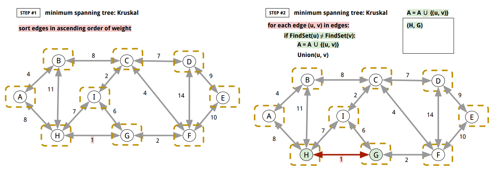
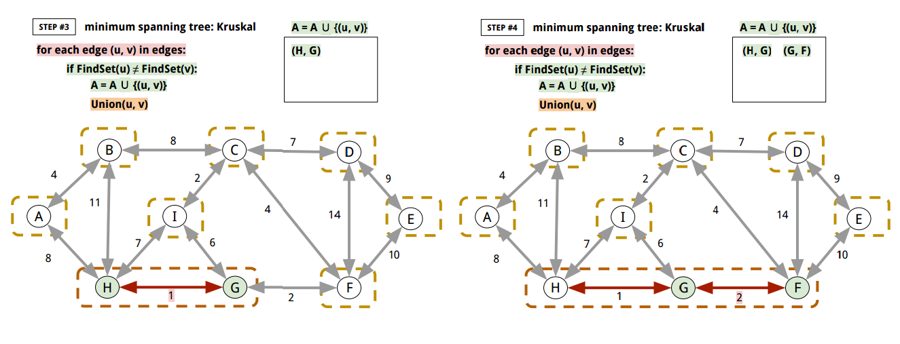
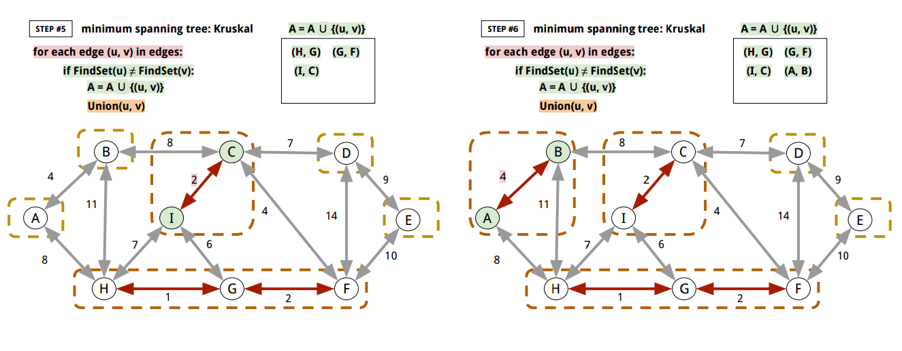

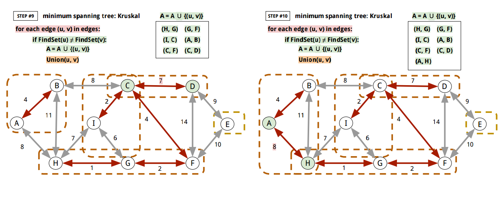
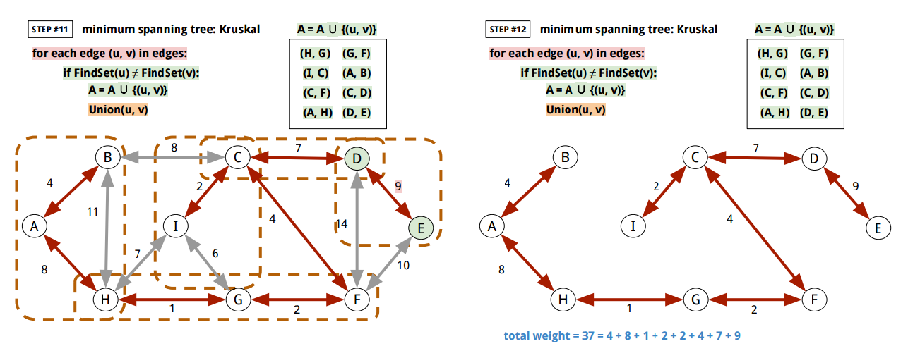

<br>
Here's Go implementation:

```go
package main

import (
	"bytes"
	"encoding/json"
	"fmt"
	"io"
	"log"
	"os"
	"sort"
	"sync"
)

// DisjointSet implements disjoint set.
// (https://en.wikipedia.org/wiki/Disjoint-set_data_structure)
type DisjointSet struct {
	represent string
	members   map[string]struct{}
}

// Forests is a set of DisjointSet.
type Forests struct {
	mu   sync.Mutex // guards the following
	data map[*DisjointSet]struct{}
}

// NewForests creates a new Forests.
func NewForests() *Forests {
	set := &Forests{}
	set.data = make(map[*DisjointSet]struct{})
	return set
}

// MakeDisjointSet creates a DisjointSet.
func MakeDisjointSet(forests *Forests, name string) {
	newDS := &DisjointSet{}
	newDS.represent = name
	members := make(map[string]struct{})
	members[name] = struct{}{}
	newDS.members = members
	forests.mu.Lock()
	defer forests.mu.Unlock()
	forests.data[newDS] = struct{}{}
}

// FindSet returns the DisjointSet with the represent name.
func FindSet(forests *Forests, name string) *DisjointSet {
	forests.mu.Lock()
	defer forests.mu.Unlock()
	for data := range forests.data {
		if data.represent == name {
			return data
		}
		for k := range data.members {
			if k == name {
				return data
			}
		}
	}
	return nil
}

// Union unions two DisjointSet, with ds1's represent.
func Union(forests *Forests, ds1, ds2 *DisjointSet) {
	newDS := &DisjointSet{}
	newDS.represent = ds1.represent
	newDS.members = ds1.members
	for k := range ds2.members {
		newDS.members[k] = struct{}{}
	}
	forests.mu.Lock()
	defer forests.mu.Unlock()
	forests.data[newDS] = struct{}{}
	delete(forests.data, ds1)
	delete(forests.data, ds2)
}

// Kruskal finds the minimum spanning tree with disjoint-set data structure.
// (http://en.wikipedia.org/wiki/Kruskal%27s_algorithm)
//
//	 0. Kruskal(G)
//	 1.
//	 2. 	A = ∅
//	 3.
//	 4. 	for each vertex v in G:
//	 5. 		MakeDisjointSet(v)
//	 6.
//	 7. 	edges = get all edges
//	 8. 	sort edges in ascending order of weight
//	 9.
//	10. 	for each edge (u, v) in edges:
//	11. 		if FindSet(u) ≠ FindSet(v):
//	12. 			A = A ∪ {(u, v)}
//	13. 			Union(u, v)
//	14.
//	15. 	return A
//
func Kruskal(g Graph) (map[Edge]struct{}, error) {

	// A = ∅
	A := make(map[Edge]struct{})

	// disjointSet maps a member Node to a represent.
	// (https://en.wikipedia.org/wiki/Disjoint-set_data_structure)
	forests := NewForests()

	// for each vertex v in G:
	for _, nd := range g.GetNodes() {
		// MakeDisjointSet(v)
		MakeDisjointSet(forests, nd.String())
	}

	// edges = get all edges
	edges := []Edge{}
	foundEdge := make(map[string]struct{})
	for id1, nd1 := range g.GetNodes() {
		tm, err := g.GetTargets(id1)
		if err != nil {
			return nil, err
		}
		for id2, nd2 := range tm {
			weight, err := g.GetWeight(id1, id2)
			if err != nil {
				return nil, err
			}
			edge := NewEdge(nd1, nd2, weight)
			if _, ok := foundEdge[edge.String()]; !ok {
				edges = append(edges, edge)
				foundEdge[edge.String()] = struct{}{}
			}
		}

		sm, err := g.GetSources(id1)
		if err != nil {
			return nil, err
		}
		for id3, nd3 := range sm {
			weight, err := g.GetWeight(id3, id1)
			if err != nil {
				return nil, err
			}
			edge := NewEdge(nd3, nd1, weight)
			if _, ok := foundEdge[edge.String()]; !ok {
				edges = append(edges, edge)
				foundEdge[edge.String()] = struct{}{}
			}
		}
	}

	// sort edges in ascending order of weight
	sort.Sort(EdgeSlice(edges))

	// for each edge (u, v) in edges:
	for _, edge := range edges {
		// if FindSet(u) ≠ FindSet(v):
		if FindSet(forests, edge.Source().String()).represent != FindSet(forests, edge.Target().String()).represent {

			// A = A ∪ {(u, v)}
			A[edge] = struct{}{}

			// Union(u, v)
			// overwrite v's represent with u's represent
			Union(forests, FindSet(forests, edge.Source().String()), FindSet(forests, edge.Target().String()))
		}
	}

	return A, nil
}

func main() {
	f, err := os.Open("graph.json")
	if err != nil {
		panic(err)
	}
	defer f.Close()
	g, err := NewGraphFromJSON(f, "graph_13")
	if err != nil {
		panic(err)
	}
	A, err := Kruskal(g)
	if err != nil {
		panic(err)
	}
	total := 0.0
	for edge := range A {
		total += edge.Weight()
	}
	if total != 37.0 {
		log.Fatalf("Expected total 37.0 but %.2f", total)
	}
	fmt.Println("Kruskal from graph_13:", A)
	/*
	   Kruskal from graph_13: map[B -- 4.000 -→ A
	   :{} F -- 4.000 -→ C
	   :{} C -- 7.000 -→ D
	   :{} H -- 8.000 -→ A
	   :{} D -- 9.000 -→ E
	   :{} G -- 1.000 -→ H
	   :{} I -- 2.000 -→ C
	   :{} G -- 2.000 -→ F
	   :{}]
	*/
}

// ID is unique identifier.
type ID interface {
	// String returns the string ID.
	String() string
}

type StringID string

func (s StringID) String() string {
	return string(s)
}

// Node is vertex. The ID must be unique within the graph.
type Node interface {
	// ID returns the ID.
	ID() ID
	String() string
}

type node struct {
	id string
}

var nodeCnt uint64

func NewNode(id string) Node {
	return &node{
		id: id,
	}
}

func (n *node) ID() ID {
	return StringID(n.id)
}

func (n *node) String() string {
	return n.id
}

// Edge connects between two Nodes.
type Edge interface {
	Source() Node
	Target() Node
	Weight() float64
	String() string
}

// edge is an Edge from Source to Target.
type edge struct {
	src Node
	tgt Node
	wgt float64
}

func NewEdge(src, tgt Node, wgt float64) Edge {
	return &edge{
		src: src,
		tgt: tgt,
		wgt: wgt,
	}
}

func (e *edge) Source() Node {
	return e.src
}

func (e *edge) Target() Node {
	return e.tgt
}

func (e *edge) Weight() float64 {
	return e.wgt
}

func (e *edge) String() string {
	return fmt.Sprintf("%s -- %.3f -→ %s\n", e.src, e.wgt, e.tgt)
}

type EdgeSlice []Edge

func (e EdgeSlice) Len() int           { return len(e) }
func (e EdgeSlice) Less(i, j int) bool { return e[i].Weight() < e[j].Weight() }
func (e EdgeSlice) Swap(i, j int)      { e[i], e[j] = e[j], e[i] }

// Graph describes the methods of graph operations.
// It assumes that the identifier of a Node is unique.
// And weight values is float64.
type Graph interface {
	// Init initializes a Graph.
	Init()

	// GetNodeCount returns the total number of nodes.
	GetNodeCount() int

	// GetNode finds the Node. It returns nil if the Node
	// does not exist in the graph.
	GetNode(id ID) Node

	// GetNodes returns a map from node ID to
	// empty struct value. Graph does not allow duplicate
	// node ID or name.
	GetNodes() map[ID]Node

	// AddNode adds a node to a graph, and returns false
	// if the node already existed in the graph.
	AddNode(nd Node) bool

	// DeleteNode deletes a node from a graph.
	// It returns true if it got deleted.
	// And false if it didn't get deleted.
	DeleteNode(id ID) bool

	// AddEdge adds an edge from nd1 to nd2 with the weight.
	// It returns error if a node does not exist.
	AddEdge(id1, id2 ID, weight float64) error

	// ReplaceEdge replaces an edge from id1 to id2 with the weight.
	ReplaceEdge(id1, id2 ID, weight float64) error

	// DeleteEdge deletes an edge from id1 to id2.
	DeleteEdge(id1, id2 ID) error

	// GetWeight returns the weight from id1 to id2.
	GetWeight(id1, id2 ID) (float64, error)

	// GetSources returns the map of parent Nodes.
	// (Nodes that come towards the argument vertex.)
	GetSources(id ID) (map[ID]Node, error)

	// GetTargets returns the map of child Nodes.
	// (Nodes that go out of the argument vertex.)
	GetTargets(id ID) (map[ID]Node, error)

	// String describes the Graph.
	String() string
}

// graph is an internal default graph type that
// implements all methods in Graph interface.
type graph struct {
	mu sync.RWMutex // guards the following

	// idToNodes stores all nodes.
	idToNodes map[ID]Node

	// nodeToSources maps a Node identifer to sources(parents) with edge weights.
	nodeToSources map[ID]map[ID]float64

	// nodeToTargets maps a Node identifer to targets(children) with edge weights.
	nodeToTargets map[ID]map[ID]float64
}

// newGraph returns a new graph.
func newGraph() *graph {
	return &graph{
		idToNodes:     make(map[ID]Node),
		nodeToSources: make(map[ID]map[ID]float64),
		nodeToTargets: make(map[ID]map[ID]float64),
		//
		// without this
		// panic: assignment to entry in nil map
	}
}

// NewGraph returns a new graph.
func NewGraph() Graph {
	return newGraph()
}

func (g *graph) Init() {
	// (X) g = newGraph()
	// this only updates the pointer
	//
	//
	// (X) *g = *newGraph()
	// assignment copies lock value

	g.idToNodes = make(map[ID]Node)
	g.nodeToSources = make(map[ID]map[ID]float64)
	g.nodeToTargets = make(map[ID]map[ID]float64)
}

func (g *graph) GetNodeCount() int {
	g.mu.RLock()
	defer g.mu.RUnlock()

	return len(g.idToNodes)
}

func (g *graph) GetNode(id ID) Node {
	g.mu.RLock()
	defer g.mu.RUnlock()

	return g.idToNodes[id]
}

func (g *graph) GetNodes() map[ID]Node {
	g.mu.RLock()
	defer g.mu.RUnlock()

	return g.idToNodes
}

func (g *graph) unsafeExistID(id ID) bool {
	_, ok := g.idToNodes[id]
	return ok
}

func (g *graph) AddNode(nd Node) bool {
	g.mu.Lock()
	defer g.mu.Unlock()

	if g.unsafeExistID(nd.ID()) {
		return false
	}

	id := nd.ID()
	g.idToNodes[id] = nd
	return true
}

func (g *graph) DeleteNode(id ID) bool {
	g.mu.Lock()
	defer g.mu.Unlock()

	if !g.unsafeExistID(id) {
		return false
	}

	delete(g.idToNodes, id)

	delete(g.nodeToTargets, id)
	for _, smap := range g.nodeToTargets {
		delete(smap, id)
	}

	delete(g.nodeToSources, id)
	for _, smap := range g.nodeToSources {
		delete(smap, id)
	}

	return true
}

func (g *graph) AddEdge(id1, id2 ID, weight float64) error {
	g.mu.Lock()
	defer g.mu.Unlock()

	if !g.unsafeExistID(id1) {
		return fmt.Errorf("%s does not exist in the graph.", id1)
	}
	if !g.unsafeExistID(id2) {
		return fmt.Errorf("%s does not exist in the graph.", id2)
	}

	if _, ok := g.nodeToTargets[id1]; ok {
		if v, ok2 := g.nodeToTargets[id1][id2]; ok2 {
			g.nodeToTargets[id1][id2] = v + weight
		} else {
			g.nodeToTargets[id1][id2] = weight
		}
	} else {
		tmap := make(map[ID]float64)
		tmap[id2] = weight
		g.nodeToTargets[id1] = tmap
	}
	if _, ok := g.nodeToSources[id2]; ok {
		if v, ok2 := g.nodeToSources[id2][id1]; ok2 {
			g.nodeToSources[id2][id1] = v + weight
		} else {
			g.nodeToSources[id2][id1] = weight
		}
	} else {
		tmap := make(map[ID]float64)
		tmap[id1] = weight
		g.nodeToSources[id2] = tmap
	}

	return nil
}

func (g *graph) ReplaceEdge(id1, id2 ID, weight float64) error {
	g.mu.Lock()
	defer g.mu.Unlock()

	if !g.unsafeExistID(id1) {
		return fmt.Errorf("%s does not exist in the graph.", id1)
	}
	if !g.unsafeExistID(id2) {
		return fmt.Errorf("%s does not exist in the graph.", id2)
	}

	if _, ok := g.nodeToTargets[id1]; ok {
		g.nodeToTargets[id1][id2] = weight
	} else {
		tmap := make(map[ID]float64)
		tmap[id2] = weight
		g.nodeToTargets[id1] = tmap
	}
	if _, ok := g.nodeToSources[id2]; ok {
		g.nodeToSources[id2][id1] = weight
	} else {
		tmap := make(map[ID]float64)
		tmap[id1] = weight
		g.nodeToSources[id2] = tmap
	}
	return nil
}

func (g *graph) DeleteEdge(id1, id2 ID) error {
	g.mu.Lock()
	defer g.mu.Unlock()

	if !g.unsafeExistID(id1) {
		return fmt.Errorf("%s does not exist in the graph.", id1)
	}
	if !g.unsafeExistID(id2) {
		return fmt.Errorf("%s does not exist in the graph.", id2)
	}

	if _, ok := g.nodeToTargets[id1]; ok {
		if _, ok := g.nodeToTargets[id1][id2]; ok {
			delete(g.nodeToTargets[id1], id2)
		}
	}
	if _, ok := g.nodeToSources[id2]; ok {
		if _, ok := g.nodeToSources[id2][id1]; ok {
			delete(g.nodeToSources[id2], id1)
		}
	}
	return nil
}

func (g *graph) GetWeight(id1, id2 ID) (float64, error) {
	g.mu.RLock()
	defer g.mu.RUnlock()

	if !g.unsafeExistID(id1) {
		return 0, fmt.Errorf("%s does not exist in the graph.", id1)
	}
	if !g.unsafeExistID(id2) {
		return 0, fmt.Errorf("%s does not exist in the graph.", id2)
	}

	if _, ok := g.nodeToTargets[id1]; ok {
		if v, ok := g.nodeToTargets[id1][id2]; ok {
			return v, nil
		}
	}
	return 0.0, fmt.Errorf("there is no edge from %s to %s", id1, id2)
}

func (g *graph) GetSources(id ID) (map[ID]Node, error) {
	g.mu.RLock()
	defer g.mu.RUnlock()

	if !g.unsafeExistID(id) {
		return nil, fmt.Errorf("%s does not exist in the graph.", id)
	}

	rs := make(map[ID]Node)
	if _, ok := g.nodeToSources[id]; ok {
		for n := range g.nodeToSources[id] {
			rs[n] = g.idToNodes[n]
		}
	}
	return rs, nil
}

func (g *graph) GetTargets(id ID) (map[ID]Node, error) {
	g.mu.RLock()
	defer g.mu.RUnlock()

	if !g.unsafeExistID(id) {
		return nil, fmt.Errorf("%s does not exist in the graph.", id)
	}

	rs := make(map[ID]Node)
	if _, ok := g.nodeToTargets[id]; ok {
		for n := range g.nodeToTargets[id] {
			rs[n] = g.idToNodes[n]
		}
	}
	return rs, nil
}

func (g *graph) String() string {
	g.mu.RLock()
	defer g.mu.RUnlock()

	buf := new(bytes.Buffer)
	for id1, nd1 := range g.idToNodes {
		nmap, _ := g.GetTargets(id1)
		for id2, nd2 := range nmap {
			weight, _ := g.GetWeight(id1, id2)
			fmt.Fprintf(buf, "%s -- %.3f -→ %s\n", nd1, weight, nd2)
		}
	}
	return buf.String()
}

// NewGraphFromJSON returns a new Graph from a JSON file.
// Here's the sample JSON data:
//
//	{
//	    "graph_00": {
//	        "S": {
//	            "A": 100,
//	            "B": 14,
//	            "C": 200
//	        },
//	        "A": {
//	            "S": 15,
//	            "B": 5,
//	            "D": 20,
//	            "T": 44
//	        },
//	        "B": {
//	            "S": 14,
//	            "A": 5,
//	            "D": 30,
//	            "E": 18
//	        },
//	        "C": {
//	            "S": 9,
//	            "E": 24
//	        },
//	        "D": {
//	            "A": 20,
//	            "B": 30,
//	            "E": 2,
//	            "F": 11,
//	            "T": 16
//	        },
//	        "E": {
//	            "B": 18,
//	            "C": 24,
//	            "D": 2,
//	            "F": 6,
//	            "T": 19
//	        },
//	        "F": {
//	            "D": 11,
//	            "E": 6,
//	            "T": 6
//	        },
//	        "T": {
//	            "A": 44,
//	            "D": 16,
//	            "F": 6,
//	            "E": 19
//	        }
//	    },
//	}
//
func NewGraphFromJSON(rd io.Reader, graphID string) (Graph, error) {
	js := make(map[string]map[string]map[string]float64)
	dec := json.NewDecoder(rd)
	for {
		if err := dec.Decode(&js); err == io.EOF {
			break
		} else if err != nil {
			return nil, err
		}
	}
	if _, ok := js[graphID]; !ok {
		return nil, fmt.Errorf("%s does not exist", graphID)
	}
	gmap := js[graphID]

	g := newGraph()
	for id1, mm := range gmap {
		nd1 := g.GetNode(StringID(id1))
		if nd1 == nil {
			nd1 = NewNode(id1)
			if ok := g.AddNode(nd1); !ok {
				return nil, fmt.Errorf("%s already exists", nd1)
			}
		}
		for id2, weight := range mm {
			nd2 := g.GetNode(StringID(id2))
			if nd2 == nil {
				nd2 = NewNode(id2)
				if ok := g.AddNode(nd2); !ok {
					return nil, fmt.Errorf("%s already exists", nd2)
				}
			}
			g.ReplaceEdge(nd1.ID(), nd2.ID(), weight)
		}
	}

	return g, nil
}

```

[↑ top](#go-graph-minimum-spanning-tree)
<br><br><br><br><hr>


#### Prim algorithm

> In computer science, Prim's algorithm is a greedy algorithm that
> finds a minimum spanning tree for a weighted undirected graph.
> This means it finds a subset of the edges that forms a tree that
> includes every vertex, where the total weight of all the edges in
> the tree is minimized. The algorithm operates by building this tree
> one vertex at a time, from an arbitrary starting vertex, at each
> step adding the cheapest possible connection from the tree to
> another vertex.
>
> [*Prim's algorithm*](https://en.wikipedia.org/wiki/Prim%27s_algorithm)
> *by Wikipedia*

```
 0. Prim(G, source)
 1.
 2. 	let Q be a priority queue
 3. 	distance[source] = 0
 4.
 5. 	for each vertex v in G:
 6.
 7. 		if v ≠ source:
 8. 			distance[v] = ∞
 9. 			prev[v] = undefined
10.
11. 		Q.add_with_priority(v, distance[v])
12.
13.
14. 	while Q is not empty:
15.
16. 		u = Q.extract_min()
17.
18. 		for each adjacent vertex v of u:
19.
21. 			if v ∈ Q and distance[v] > weight(u, v):
22. 				distance[v] = weight(u, v)
23. 				prev[v] = u
24. 				Q.decrease_priority(v, weight(u, v))
25.
26.
27. 	return tree from prev
```

<br>
Here's how it works:

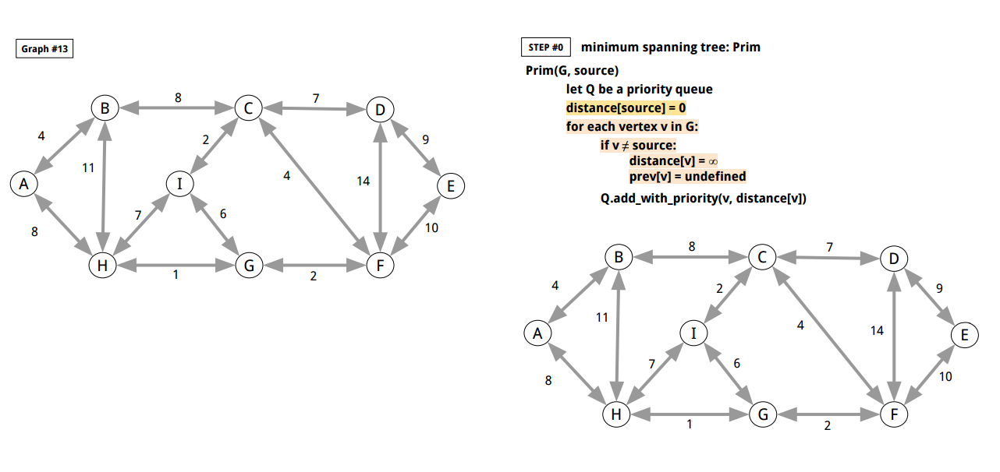

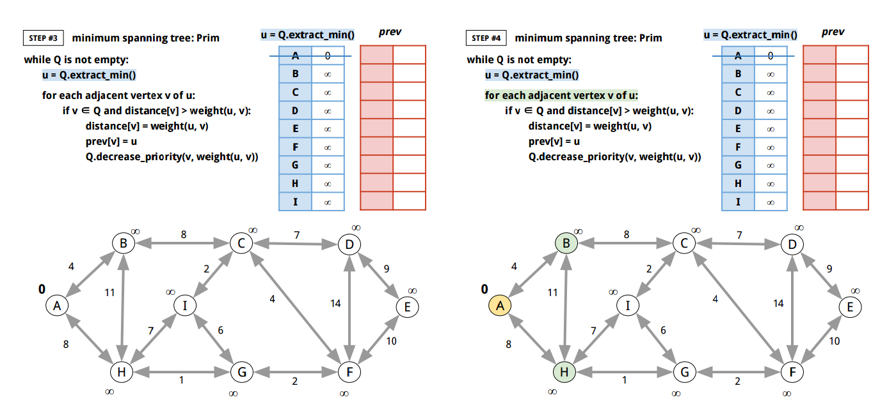
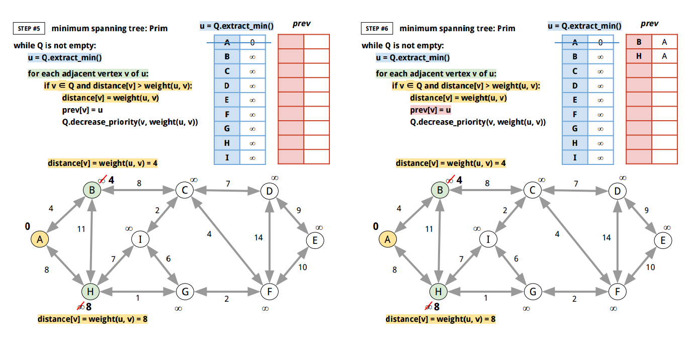
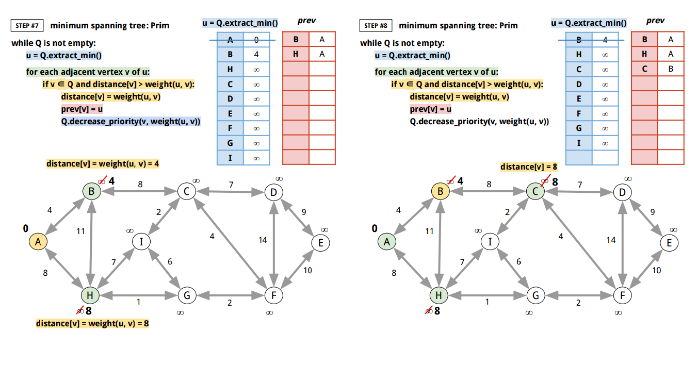


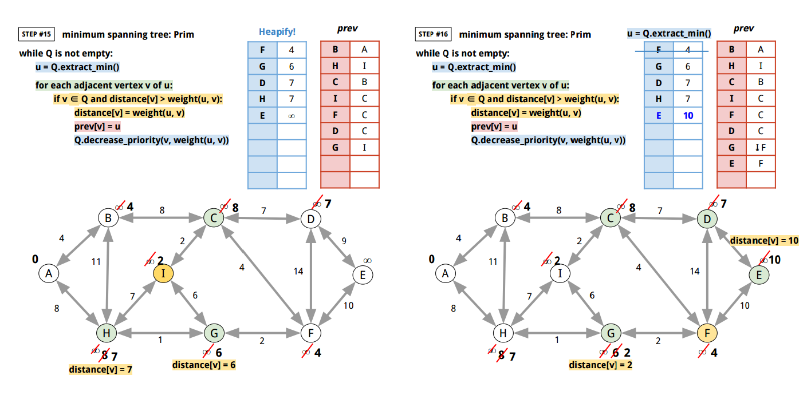
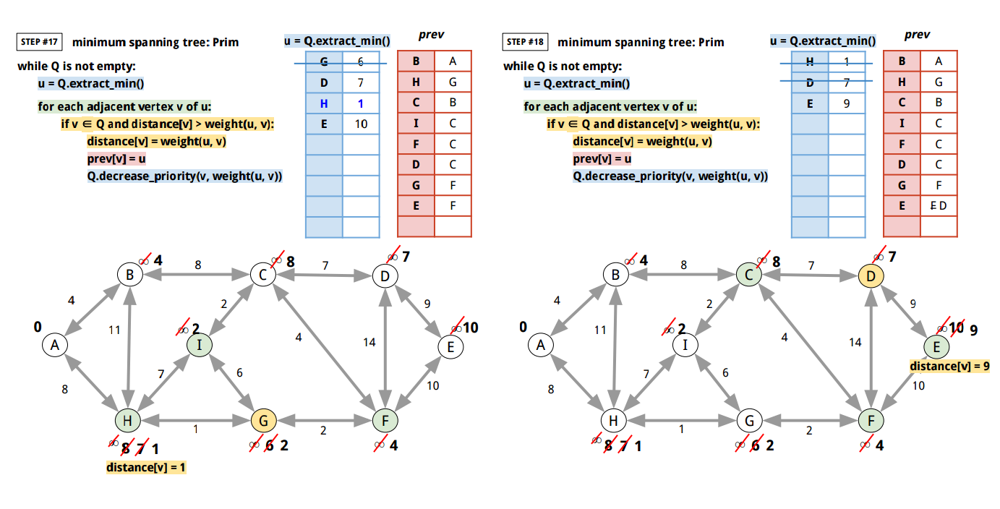


<br>
Here's Go implementation:

```go
package main

import (
	"bytes"
	"container/heap"
	"encoding/json"
	"fmt"
	"io"
	"log"
	"math"
	"os"
	"sync"
)

// Prim finds the minimum spanning tree with min-heap (priority queue).
// (http://en.wikipedia.org/wiki/Prim%27s_algorithm)
//
//	 0. Prim(G, source)
//	 1.
//	 2. 	let Q be a priority queue
//	 3. 	distance[source] = 0
//	 4.
//	 5. 	for each vertex v in G:
//	 6.
//	 7. 		if v ≠ source:
//	 8. 			distance[v] = ∞
//	 9. 			prev[v] = undefined
//	10.
//	11. 		Q.add_with_priority(v, distance[v])
//	12.
//	13.
//	14. 	while Q is not empty:
//	15.
//	16. 		u = Q.extract_min()
//	17.
//	18. 		for each adjacent vertex v of u:
//	19.
//	21. 			if v ∈ Q and distance[v] > weight(u, v):
//	22. 				distance[v] = weight(u, v)
//	23. 				prev[v] = u
//	24. 				Q.decrease_priority(v, weight(u, v))
//	25.
//	26.
//	27. 	return tree from prev
//
func Prim(g Graph, src ID) (map[Edge]struct{}, error) {

	// let Q be a priority queue
	minHeap := &nodeDistanceHeap{}

	// distance[source] = 0
	distance := make(map[ID]float64)
	distance[src] = 0.0

	// for each vertex v in G:
	for id := range g.GetNodes() {

		// if v ≠ src:
		if id != src {
			// distance[v] = ∞
			distance[id] = math.MaxFloat64

			// prev[v] = undefined
			// prev[v] = ""
		}

		// Q.add_with_priority(v, distance[v])
		nds := nodeDistance{}
		nds.id = id
		nds.distance = distance[id]

		heap.Push(minHeap, nds)
	}

	heap.Init(minHeap)
	prev := make(map[ID]ID)

	// while Q is not empty:
	for minHeap.Len() != 0 {

		// u = Q.extract_min()
		u := heap.Pop(minHeap).(nodeDistance)
		uID := u.id

		// for each adjacent vertex v of u:
		tm, err := g.GetTargets(uID)
		if err != nil {
			return nil, err
		}
		for vID := range tm {

			isExist := false
			for _, one := range *minHeap {
				if vID == one.id {
					isExist = true
					break
				}
			}

			// weight(u, v)
			weight, err := g.GetWeight(uID, vID)
			if err != nil {
				return nil, err
			}

			// if v ∈ Q and distance[v] > weight(u, v):
			if isExist && distance[vID] > weight {

				// distance[v] = weight(u, v)
				distance[vID] = weight

				// prev[v] = u
				prev[vID] = uID

				// Q.decrease_priority(v, weight(u, v))
				minHeap.updateDistance(vID, weight)
				heap.Init(minHeap)
			}
		}

		sm, err := g.GetSources(uID)
		if err != nil {
			return nil, err
		}
		vID := uID
		for uID := range sm {

			isExist := false
			for _, one := range *minHeap {
				if vID == one.id {
					isExist = true
					break
				}
			}

			// weight(u, v)
			weight, err := g.GetWeight(uID, vID)
			if err != nil {
				return nil, err
			}

			// if v ∈ Q and distance[v] > weight(u, v):
			if isExist && distance[vID] > weight {

				// distance[v] = weight(u, v)
				distance[vID] = weight

				// prev[v] = u
				prev[vID] = uID

				// Q.decrease_priority(v, weight(u, v))
				minHeap.updateDistance(vID, weight)
				heap.Init(minHeap)
			}
		}
	}

	tree := make(map[Edge]struct{})
	for k, v := range prev {
		weight, err := g.GetWeight(v, k)
		if err != nil {
			return nil, err
		}
		tree[NewEdge(g.GetNode(v), g.GetNode(k), weight)] = struct{}{}
	}
	return tree, nil
}

type nodeDistance struct {
	id       ID
	distance float64
}

// container.Heap's Interface needs sort.Interface, Push, Pop to be implemented

// nodeDistanceHeap is a min-heap of nodeDistances.
type nodeDistanceHeap []nodeDistance

func (h nodeDistanceHeap) Len() int           { return len(h) }
func (h nodeDistanceHeap) Less(i, j int) bool { return h[i].distance < h[j].distance } // Min-Heap
func (h nodeDistanceHeap) Swap(i, j int)      { h[i], h[j] = h[j], h[i] }

func (h *nodeDistanceHeap) Push(x interface{}) {
	*h = append(*h, x.(nodeDistance))
}

func (h *nodeDistanceHeap) Pop() interface{} {
	heapSize := len(*h)
	lastNode := (*h)[heapSize-1]
	*h = (*h)[0 : heapSize-1]
	return lastNode
}

func (h *nodeDistanceHeap) updateDistance(id ID, val float64) {
	for i := 0; i < len(*h); i++ {
		if (*h)[i].id == id {
			(*h)[i].distance = val
			break
		}
	}
}

func main() {
	f, err := os.Open("graph.json")
	if err != nil {
		panic(err)
	}
	defer f.Close()
	g, err := NewGraphFromJSON(f, "graph_13")
	if err != nil {
		panic(err)
	}
	for v := range g.GetNodes() {
		A, err := Prim(g, v)
		if err != nil {
			panic(err)
		}
		total := 0.0
		for edge := range A {
			total += edge.Weight()
		}
		if total != 37.0 {
			log.Fatalf("Expected total 37.0 but %.2f", total)
		}
		fmt.Println("Prim from graph_13:", A, "with", v)
	}
	/*
		Prim from graph_13: map[F -- 4.000 -→ C
		:{} C -- 7.000 -→ D
		:{} D -- 9.000 -→ E
		:{} C -- 2.000 -→ I
		:{} H -- 1.000 -→ G
		:{} H -- 8.000 -→ A
		:{} A -- 4.000 -→ B
		:{} G -- 2.000 -→ F
		:{}] with H
		Prim from graph_13: map[C -- 7.000 -→ D
		:{} D -- 9.000 -→ E
		:{} A -- 4.000 -→ B
		:{} A -- 8.000 -→ H
		:{} F -- 4.000 -→ C
		:{} C -- 2.000 -→ I
		:{} H -- 1.000 -→ G
		:{} G -- 2.000 -→ F
		:{}] with A
		Prim from graph_13: map[C -- 8.000 -→ B
		:{} C -- 2.000 -→ I
		:{} C -- 4.000 -→ F
		:{} F -- 2.000 -→ G
		:{} G -- 1.000 -→ H
		:{} D -- 9.000 -→ E
		:{} B -- 4.000 -→ A
		:{} C -- 7.000 -→ D
		:{}] with C
		Prim from graph_13: map[G -- 1.000 -→ H
		:{} F -- 2.000 -→ G
		:{} B -- 4.000 -→ A
		:{} D -- 7.000 -→ C
		:{} C -- 4.000 -→ F
		:{} D -- 9.000 -→ E
		:{} C -- 8.000 -→ B
		:{} C -- 2.000 -→ I
		:{}] with D
		Prim from graph_13: map[D -- 9.000 -→ E
		:{} B -- 4.000 -→ A
		:{} G -- 1.000 -→ H
		:{} B -- 8.000 -→ C
		:{} C -- 4.000 -→ F
		:{} C -- 7.000 -→ D
		:{} C -- 2.000 -→ I
		:{} F -- 2.000 -→ G
		:{}] with B
		Prim from graph_13: map[H -- 8.000 -→ A
		:{} G -- 1.000 -→ H
		:{} F -- 2.000 -→ G
		:{} I -- 2.000 -→ C
		:{} C -- 4.000 -→ F
		:{} C -- 7.000 -→ D
		:{} A -- 4.000 -→ B
		:{} D -- 9.000 -→ E
		:{}] with I
		Prim from graph_13: map[C -- 8.000 -→ B
		:{} F -- 4.000 -→ C
		:{} C -- 7.000 -→ D
		:{} D -- 9.000 -→ E
		:{} G -- 1.000 -→ H
		:{} C -- 2.000 -→ I
		:{} G -- 2.000 -→ F
		:{} B -- 4.000 -→ A
		:{}] with G
		Prim from graph_13: map[F -- 2.000 -→ G
		:{} F -- 4.000 -→ C
		:{} C -- 7.000 -→ D
		:{} D -- 9.000 -→ E
		:{} G -- 1.000 -→ H
		:{} C -- 2.000 -→ I
		:{} H -- 8.000 -→ A
		:{} A -- 4.000 -→ B
		:{}] with F
		Prim from graph_13: map[C -- 8.000 -→ B
		:{} C -- 2.000 -→ I
		:{} G -- 1.000 -→ H
		:{} F -- 2.000 -→ G
		:{} B -- 4.000 -→ A
		:{} E -- 9.000 -→ D
		:{} C -- 4.000 -→ F
		:{} D -- 7.000 -→ C
		:{}] with E
	*/
}

// ID is unique identifier.
type ID interface {
	// String returns the string ID.
	String() string
}

type StringID string

func (s StringID) String() string {
	return string(s)
}

// Node is vertex. The ID must be unique within the graph.
type Node interface {
	// ID returns the ID.
	ID() ID
	String() string
}

type node struct {
	id string
}

var nodeCnt uint64

func NewNode(id string) Node {
	return &node{
		id: id,
	}
}

func (n *node) ID() ID {
	return StringID(n.id)
}

func (n *node) String() string {
	return n.id
}

// Edge connects between two Nodes.
type Edge interface {
	Source() Node
	Target() Node
	Weight() float64
	String() string
}

// edge is an Edge from Source to Target.
type edge struct {
	src Node
	tgt Node
	wgt float64
}

func NewEdge(src, tgt Node, wgt float64) Edge {
	return &edge{
		src: src,
		tgt: tgt,
		wgt: wgt,
	}
}

func (e *edge) Source() Node {
	return e.src
}

func (e *edge) Target() Node {
	return e.tgt
}

func (e *edge) Weight() float64 {
	return e.wgt
}

func (e *edge) String() string {
	return fmt.Sprintf("%s -- %.3f -→ %s\n", e.src, e.wgt, e.tgt)
}

type EdgeSlice []Edge

func (e EdgeSlice) Len() int           { return len(e) }
func (e EdgeSlice) Less(i, j int) bool { return e[i].Weight() < e[j].Weight() }
func (e EdgeSlice) Swap(i, j int)      { e[i], e[j] = e[j], e[i] }

// Graph describes the methods of graph operations.
// It assumes that the identifier of a Node is unique.
// And weight values is float64.
type Graph interface {
	// Init initializes a Graph.
	Init()

	// GetNodeCount returns the total number of nodes.
	GetNodeCount() int

	// GetNode finds the Node. It returns nil if the Node
	// does not exist in the graph.
	GetNode(id ID) Node

	// GetNodes returns a map from node ID to
	// empty struct value. Graph does not allow duplicate
	// node ID or name.
	GetNodes() map[ID]Node

	// AddNode adds a node to a graph, and returns false
	// if the node already existed in the graph.
	AddNode(nd Node) bool

	// DeleteNode deletes a node from a graph.
	// It returns true if it got deleted.
	// And false if it didn't get deleted.
	DeleteNode(id ID) bool

	// AddEdge adds an edge from nd1 to nd2 with the weight.
	// It returns error if a node does not exist.
	AddEdge(id1, id2 ID, weight float64) error

	// ReplaceEdge replaces an edge from id1 to id2 with the weight.
	ReplaceEdge(id1, id2 ID, weight float64) error

	// DeleteEdge deletes an edge from id1 to id2.
	DeleteEdge(id1, id2 ID) error

	// GetWeight returns the weight from id1 to id2.
	GetWeight(id1, id2 ID) (float64, error)

	// GetSources returns the map of parent Nodes.
	// (Nodes that come towards the argument vertex.)
	GetSources(id ID) (map[ID]Node, error)

	// GetTargets returns the map of child Nodes.
	// (Nodes that go out of the argument vertex.)
	GetTargets(id ID) (map[ID]Node, error)

	// String describes the Graph.
	String() string
}

// graph is an internal default graph type that
// implements all methods in Graph interface.
type graph struct {
	mu sync.RWMutex // guards the following

	// idToNodes stores all nodes.
	idToNodes map[ID]Node

	// nodeToSources maps a Node identifer to sources(parents) with edge weights.
	nodeToSources map[ID]map[ID]float64

	// nodeToTargets maps a Node identifer to targets(children) with edge weights.
	nodeToTargets map[ID]map[ID]float64
}

// newGraph returns a new graph.
func newGraph() *graph {
	return &graph{
		idToNodes:     make(map[ID]Node),
		nodeToSources: make(map[ID]map[ID]float64),
		nodeToTargets: make(map[ID]map[ID]float64),
		//
		// without this
		// panic: assignment to entry in nil map
	}
}

// NewGraph returns a new graph.
func NewGraph() Graph {
	return newGraph()
}

func (g *graph) Init() {
	// (X) g = newGraph()
	// this only updates the pointer
	//
	//
	// (X) *g = *newGraph()
	// assignment copies lock value

	g.idToNodes = make(map[ID]Node)
	g.nodeToSources = make(map[ID]map[ID]float64)
	g.nodeToTargets = make(map[ID]map[ID]float64)
}

func (g *graph) GetNodeCount() int {
	g.mu.RLock()
	defer g.mu.RUnlock()

	return len(g.idToNodes)
}

func (g *graph) GetNode(id ID) Node {
	g.mu.RLock()
	defer g.mu.RUnlock()

	return g.idToNodes[id]
}

func (g *graph) GetNodes() map[ID]Node {
	g.mu.RLock()
	defer g.mu.RUnlock()

	return g.idToNodes
}

func (g *graph) unsafeExistID(id ID) bool {
	_, ok := g.idToNodes[id]
	return ok
}

func (g *graph) AddNode(nd Node) bool {
	g.mu.Lock()
	defer g.mu.Unlock()

	if g.unsafeExistID(nd.ID()) {
		return false
	}

	id := nd.ID()
	g.idToNodes[id] = nd
	return true
}

func (g *graph) DeleteNode(id ID) bool {
	g.mu.Lock()
	defer g.mu.Unlock()

	if !g.unsafeExistID(id) {
		return false
	}

	delete(g.idToNodes, id)

	delete(g.nodeToTargets, id)
	for _, smap := range g.nodeToTargets {
		delete(smap, id)
	}

	delete(g.nodeToSources, id)
	for _, smap := range g.nodeToSources {
		delete(smap, id)
	}

	return true
}

func (g *graph) AddEdge(id1, id2 ID, weight float64) error {
	g.mu.Lock()
	defer g.mu.Unlock()

	if !g.unsafeExistID(id1) {
		return fmt.Errorf("%s does not exist in the graph.", id1)
	}
	if !g.unsafeExistID(id2) {
		return fmt.Errorf("%s does not exist in the graph.", id2)
	}

	if _, ok := g.nodeToTargets[id1]; ok {
		if v, ok2 := g.nodeToTargets[id1][id2]; ok2 {
			g.nodeToTargets[id1][id2] = v + weight
		} else {
			g.nodeToTargets[id1][id2] = weight
		}
	} else {
		tmap := make(map[ID]float64)
		tmap[id2] = weight
		g.nodeToTargets[id1] = tmap
	}
	if _, ok := g.nodeToSources[id2]; ok {
		if v, ok2 := g.nodeToSources[id2][id1]; ok2 {
			g.nodeToSources[id2][id1] = v + weight
		} else {
			g.nodeToSources[id2][id1] = weight
		}
	} else {
		tmap := make(map[ID]float64)
		tmap[id1] = weight
		g.nodeToSources[id2] = tmap
	}

	return nil
}

func (g *graph) ReplaceEdge(id1, id2 ID, weight float64) error {
	g.mu.Lock()
	defer g.mu.Unlock()

	if !g.unsafeExistID(id1) {
		return fmt.Errorf("%s does not exist in the graph.", id1)
	}
	if !g.unsafeExistID(id2) {
		return fmt.Errorf("%s does not exist in the graph.", id2)
	}

	if _, ok := g.nodeToTargets[id1]; ok {
		g.nodeToTargets[id1][id2] = weight
	} else {
		tmap := make(map[ID]float64)
		tmap[id2] = weight
		g.nodeToTargets[id1] = tmap
	}
	if _, ok := g.nodeToSources[id2]; ok {
		g.nodeToSources[id2][id1] = weight
	} else {
		tmap := make(map[ID]float64)
		tmap[id1] = weight
		g.nodeToSources[id2] = tmap
	}
	return nil
}

func (g *graph) DeleteEdge(id1, id2 ID) error {
	g.mu.Lock()
	defer g.mu.Unlock()

	if !g.unsafeExistID(id1) {
		return fmt.Errorf("%s does not exist in the graph.", id1)
	}
	if !g.unsafeExistID(id2) {
		return fmt.Errorf("%s does not exist in the graph.", id2)
	}

	if _, ok := g.nodeToTargets[id1]; ok {
		if _, ok := g.nodeToTargets[id1][id2]; ok {
			delete(g.nodeToTargets[id1], id2)
		}
	}
	if _, ok := g.nodeToSources[id2]; ok {
		if _, ok := g.nodeToSources[id2][id1]; ok {
			delete(g.nodeToSources[id2], id1)
		}
	}
	return nil
}

func (g *graph) GetWeight(id1, id2 ID) (float64, error) {
	g.mu.RLock()
	defer g.mu.RUnlock()

	if !g.unsafeExistID(id1) {
		return 0, fmt.Errorf("%s does not exist in the graph.", id1)
	}
	if !g.unsafeExistID(id2) {
		return 0, fmt.Errorf("%s does not exist in the graph.", id2)
	}

	if _, ok := g.nodeToTargets[id1]; ok {
		if v, ok := g.nodeToTargets[id1][id2]; ok {
			return v, nil
		}
	}
	return 0.0, fmt.Errorf("there is no edge from %s to %s", id1, id2)
}

func (g *graph) GetSources(id ID) (map[ID]Node, error) {
	g.mu.RLock()
	defer g.mu.RUnlock()

	if !g.unsafeExistID(id) {
		return nil, fmt.Errorf("%s does not exist in the graph.", id)
	}

	rs := make(map[ID]Node)
	if _, ok := g.nodeToSources[id]; ok {
		for n := range g.nodeToSources[id] {
			rs[n] = g.idToNodes[n]
		}
	}
	return rs, nil
}

func (g *graph) GetTargets(id ID) (map[ID]Node, error) {
	g.mu.RLock()
	defer g.mu.RUnlock()

	if !g.unsafeExistID(id) {
		return nil, fmt.Errorf("%s does not exist in the graph.", id)
	}

	rs := make(map[ID]Node)
	if _, ok := g.nodeToTargets[id]; ok {
		for n := range g.nodeToTargets[id] {
			rs[n] = g.idToNodes[n]
		}
	}
	return rs, nil
}

func (g *graph) String() string {
	g.mu.RLock()
	defer g.mu.RUnlock()

	buf := new(bytes.Buffer)
	for id1, nd1 := range g.idToNodes {
		nmap, _ := g.GetTargets(id1)
		for id2, nd2 := range nmap {
			weight, _ := g.GetWeight(id1, id2)
			fmt.Fprintf(buf, "%s -- %.3f -→ %s\n", nd1, weight, nd2)
		}
	}
	return buf.String()
}

// NewGraphFromJSON returns a new Graph from a JSON file.
// Here's the sample JSON data:
//
//	{
//	    "graph_00": {
//	        "S": {
//	            "A": 100,
//	            "B": 14,
//	            "C": 200
//	        },
//	        "A": {
//	            "S": 15,
//	            "B": 5,
//	            "D": 20,
//	            "T": 44
//	        },
//	        "B": {
//	            "S": 14,
//	            "A": 5,
//	            "D": 30,
//	            "E": 18
//	        },
//	        "C": {
//	            "S": 9,
//	            "E": 24
//	        },
//	        "D": {
//	            "A": 20,
//	            "B": 30,
//	            "E": 2,
//	            "F": 11,
//	            "T": 16
//	        },
//	        "E": {
//	            "B": 18,
//	            "C": 24,
//	            "D": 2,
//	            "F": 6,
//	            "T": 19
//	        },
//	        "F": {
//	            "D": 11,
//	            "E": 6,
//	            "T": 6
//	        },
//	        "T": {
//	            "A": 44,
//	            "D": 16,
//	            "F": 6,
//	            "E": 19
//	        }
//	    },
//	}
//
func NewGraphFromJSON(rd io.Reader, graphID string) (Graph, error) {
	js := make(map[string]map[string]map[string]float64)
	dec := json.NewDecoder(rd)
	for {
		if err := dec.Decode(&js); err == io.EOF {
			break
		} else if err != nil {
			return nil, err
		}
	}
	if _, ok := js[graphID]; !ok {
		return nil, fmt.Errorf("%s does not exist", graphID)
	}
	gmap := js[graphID]

	g := newGraph()
	for id1, mm := range gmap {
		nd1 := g.GetNode(StringID(id1))
		if nd1 == nil {
			nd1 = NewNode(id1)
			if ok := g.AddNode(nd1); !ok {
				return nil, fmt.Errorf("%s already exists", nd1)
			}
		}
		for id2, weight := range mm {
			nd2 := g.GetNode(StringID(id2))
			if nd2 == nil {
				nd2 = NewNode(id2)
				if ok := g.AddNode(nd2); !ok {
					return nil, fmt.Errorf("%s already exists", nd2)
				}
			}
			g.ReplaceEdge(nd1.ID(), nd2.ID(), weight)
		}
	}

	return g, nil
}

```

[↑ top](#go-graph-minimum-spanning-tree)
<br><br><br><br><hr>
