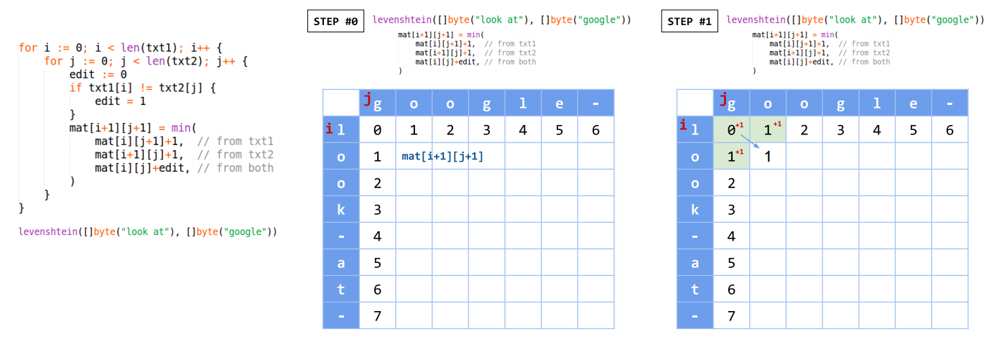
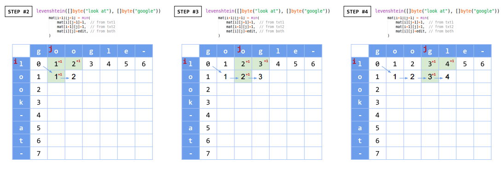
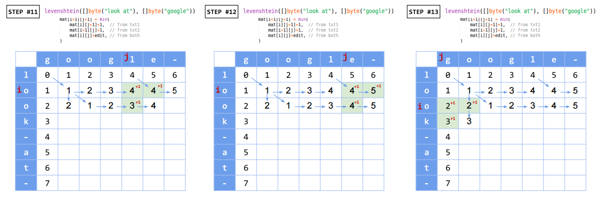
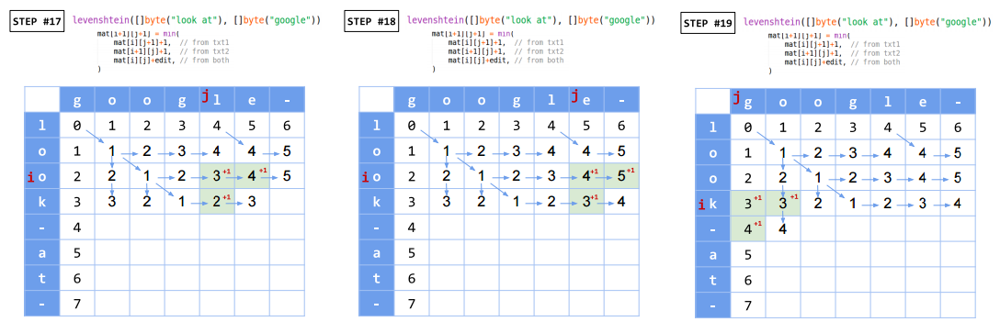
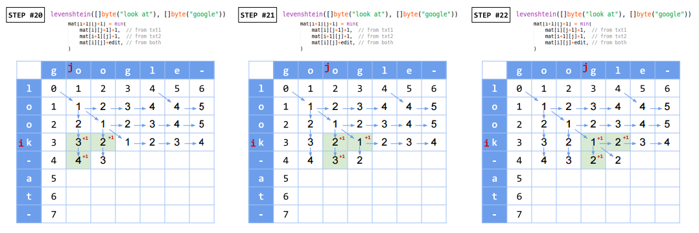
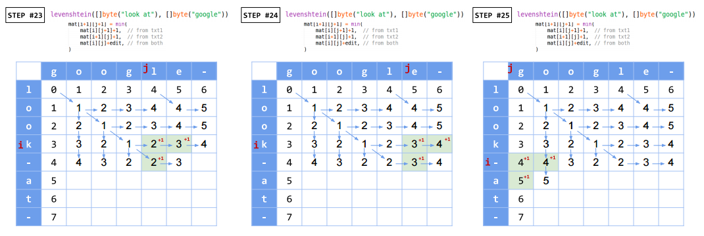
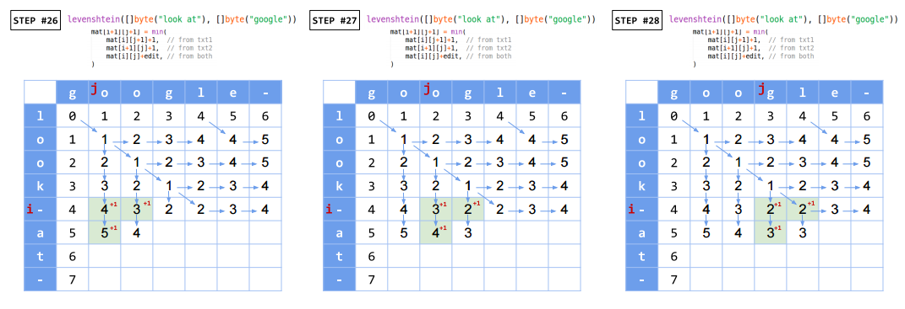
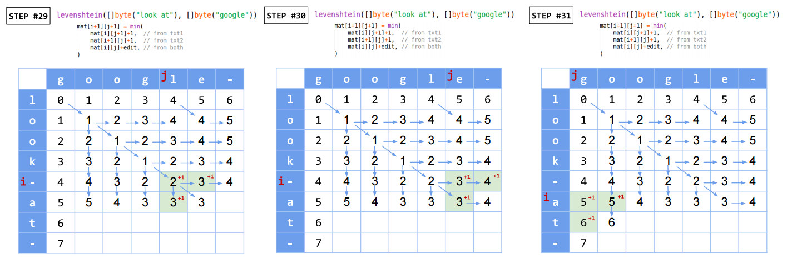
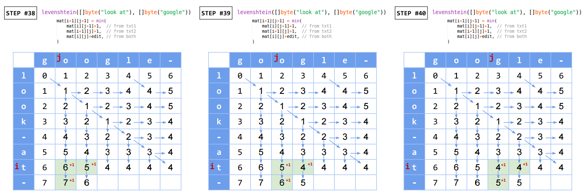
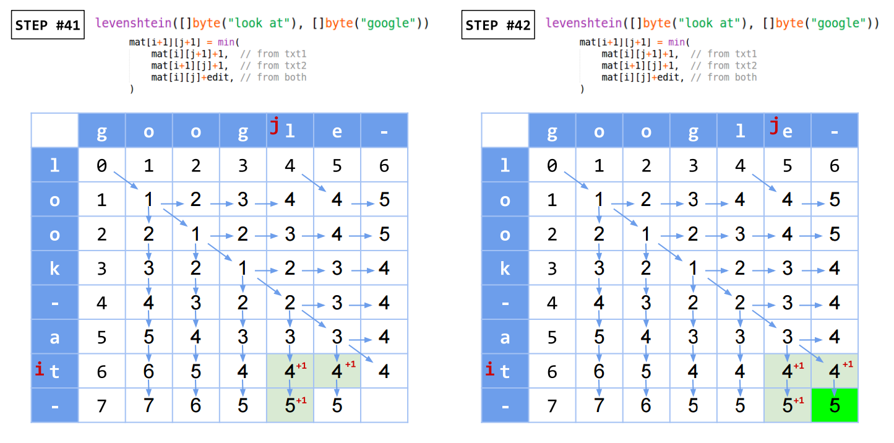

[*back to contents*](https://github.com/gyuho/learn#contents)<br>

# Go: string similarity

- [Reference](#reference)
- [Cosine similarity](#cosine-similarity)
- [Hamming distance](#hamming-distance)
- [Levenshtein distance](#levenshtein-distance)
- [string similarity](#string-similarity)

[↑ top](#go-string-similarity)
<br><br><br><br><hr>


#### Reference

- [Cosine similarity](https://en.wikipedia.org/wiki/Cosine_similarity)
- [Hamming distance](https://en.wikipedia.org/wiki/Hamming_distance)
- [Levenshtein distance](https://en.wikipedia.org/wiki/Levenshtein_distance)

[↑ top](#go-string-similarity)
<br><br><br><br><hr>


#### Cosine similarity

[Cosine similarity](https://en.wikipedia.org/wiki/Cosine_similarity)
is a measure of similarity between two vectors:


<br>
Since `cos 0° = 1` and `cos 90° = 0`, the similarity ranges between 0 and 1. 
`0°` means that the two texts are equal, since two sequences point to the same
point. 90° means that the two texts are totally different. Therefore, the
higher *cosine similarity* is, the more two texts are similar.
Try [this](http://play.golang.org/p/W40iUwGfW6):

```go
package main

import (
	"fmt"
	"math"
)

// Cosine converts texts to vectors
// associatting each chracter with its frequncy
// and caculates cosine similarities.
// (https://en.wikipedia.org/wiki/Cosine_similarity)
func Cosine(txt1, txt2 []byte) float64 {
	vect1 := make(map[byte]int)
	for _, t := range txt1 {
		vect1[t]++
	}
	vect2 := make(map[byte]int)
	for _, t := range txt2 {
		vect2[t]++
	}
	//
	// dot-product two vectors
	// map[byte]int return 0 for non-existing key
	// and if two texts are equal, product will be highest
	// and if two texts are totally different, it will be 0
	//
	// to calculate A·B
	dotProduct := 0.0
	for k, v := range vect1 {
		dotProduct += float64(v) * float64(vect2[k])
	}
	// to calculate |A|*|B|
	sum1 := 0.0
	for _, v := range vect1 {
		sum1 += math.Pow(float64(v), 2)
	}
	sum2 := 0.0
	for _, v := range vect2 {
		sum2 += math.Pow(float64(v), 2)
	}
	magnitude := math.Sqrt(sum1) * math.Sqrt(sum2)
	if magnitude == 0 {
		return 0.0
	}
	return float64(dotProduct) / float64(magnitude)
}

func main() {
	fmt.Println(Cosine([]byte("Hello"), []byte("Hello")))
	// 0.9999999999999999

	fmt.Println(Cosine([]byte(""), []byte("Hello")))
	// 0

	fmt.Println(Cosine([]byte("hello"), []byte("Hello")))
	// 0.857142857142857

	fmt.Println(Cosine([]byte("abc"), []byte("bcd")))
	// 0.6666666666666667

	fmt.Println(Cosine([]byte("Hello"), []byte("Hel lo")))
	// 0.9354143466934852
}

```

[↑ top](#go-string-similarity)
<br><br><br><br><hr>


#### Hamming distance

[Hamming distance](https://en.wikipedia.org/wiki/Hamming_distance) is defined
as the minimum number of *substituitions* required to change one string
to another. For string similarity, I slightly modified the function
so that the function `hamming` returns the similarity value that ranges
between 0 and 1, and 1 for equal texts.
Try [this](http://play.golang.org/p/ilS7NSxPJW):

```go
package main

import (
	"bytes"
	"fmt"
)

// Hamming returns the normalized similarity value.
// hamming distance is the number of differing "bits".
// hamming distance is minimum number of substitutions
// required to change one string into the other
// (https://en.wikipedia.org/wiki/Hamming_distance)
func Hamming(txt1, txt2 []byte) float64 {
	switch bytes.Compare(txt1, txt2) {
	case 0: // txt1 == txt2
	case 1: // txt1 > txt2
		temp := make([]byte, len(txt1))
		copy(temp, txt2)
		txt2 = temp
	case -1: // txt1 < txt2
		temp := make([]byte, len(txt2))
		copy(temp, txt1)
		txt1 = temp
	}
	if len(txt1) != len(txt2) {
		panic("Undefined for sequences of unequal length")
	}
	count := 0
	for idx, b1 := range txt1 {
		b2 := txt2[idx]
		xor := b1 ^ b2 // 1 if bits are different
		//
		// bit count (number of 1)
		// http://graphics.stanford.edu/~seander/bithacks.html#CountBitsSetNaive
		//
		// repeat shifting from left to right (divide by 2)
		// until all bits are zero
		for x := xor; x > 0; x >>= 1 {
			// check if lowest bit is 1
			if int(x&1) == 1 {
				count++
			}
		}
	}
	if count == 0 {
		// similarity is 1 for equal texts.
		return 1
	}
	return float64(1) / float64(count)
}

func main() {
	fmt.Println(Hamming([]byte("A"), []byte("A")))             // 1
	fmt.Println(Hamming([]byte("A"), []byte("a")))             // 1
	fmt.Println(Hamming([]byte("a"), []byte("A")))             // 1
	fmt.Println(Hamming([]byte("aaa"), []byte("aba")))         // 0.5
	fmt.Println(Hamming([]byte("aaa"), []byte("aBa")))         // 0.333
	fmt.Println(Hamming([]byte("aaa"), []byte("a a")))         // 0.5
	fmt.Println(Hamming([]byte("karolin"), []byte("kathrin"))) // 0.1111111111111111

	fmt.Println(Hamming([]byte("Hello"), []byte("Hello")))
	// 1

	fmt.Println(Hamming([]byte("Hello"), []byte("Hel lo")))
	// 0.2

	fmt.Println(Hamming([]byte(""), []byte("Hello")))
	// 0.05

	fmt.Println(Hamming([]byte("hello"), []byte("Hello")))
	// 1

	fmt.Println(Hamming([]byte("abc"), []byte("bcd")))
	// 0.16666666666666666
}

```

[↑ top](#go-string-similarity)
<br><br><br><br><hr>


#### Levenshtein distance

[Levenshtein distance](https://en.wikipedia.org/wiki/Levenshtein_distance)
is, similar to *hamming distance*, the **edit distance** between two texts
that is required to change one text to another. **Edit** means either
*insertion*, *deletion*, or *substitution*, each of which takes 1 edit
distance. **Levenshtein distance** is the **minimum number of single-character
edits**.

<br>
The levenshtein distance from `kitten` to `sitting` is 3:

1. **k**itten → **s**itten  (**substitution** of "s" for "k")
2. sitt**e**n → sitt**i**n  (**substitution** of "i" for "e")
3. sittin → sittin**g**   (**insertion** of "g" at the end)

<br>
Levenshtein distance algorithm uses
[dynamic programming](https://en.wikipedia.org/wiki/Dynamic_programming).
(I also have [YouTube clip](https://www.youtube.com/watch?v=aEIhvv5p-V8) tp
visualize how this works.)
It is an algorithm technique of recurrent processes with one *or some*
initial states. It breaks down a complex problem into simpler sub-problems.
The sub-soluition is built from previously found ones, so it needs extra
space to store the results. Essentially, it sacrifices memory space for time.

















<br>
The bigger the edit distance is, the less similar two texts are.
So we will modify the function to return the bigger values for similarities.
In Go, you would do [this](http://play.golang.org/p/UQI9mXCgww):

```go
package main

import "fmt"

// Levenshtein returns the similarity using levenshtein distance.
// (https://en.wikipedia.org/wiki/Levenshtein_distance)
func Levenshtein(txt1, txt2 []byte) float64 {
	// initialize the distance array, with position
	mat := create2Dslice(len(txt1)+1, len(txt2)+1)
	for i := 0; i < len(txt1)+1; i++ {
		mat[i][0] = i
	}
	for i := 0; i < len(txt2)+1; i++ {
		mat[0][i] = i
	}
	for i := 0; i < len(txt1); i++ {
		for j := 0; j < len(txt2); j++ {
			edit := 0
			if txt1[i] != txt2[j] {
				edit = 1
			}
			mat[i+1][j+1] = min(
				mat[i][j+1]+1,  // from txt1
				mat[i+1][j]+1,  // from txt2
				mat[i][j]+edit, // from both
			)
		}
	}
	distance := mat[len(txt1)][len(txt2)]
	if distance == 0 {
		// similarity is 1 for equal texts.
		return 1
	}
	return float64(1) / float64(distance)
}

func min(more ...int) int {
	min := more[0]
	for _, elem := range more {
		if min > elem {
			min = elem
		}
	}
	return min
}

func create2Dslice(row, column int) [][]int {
	mat := make([][]int, row)
	for i := range mat {
		mat[i] = make([]int, column)
	}
	return mat
}

func main() {
	fmt.Println(Levenshtein([]byte("Hello"), []byte("Hello")))
	// 1

	fmt.Println(Levenshtein([]byte(""), []byte("Hello")))
	// 0.2

	fmt.Println(Levenshtein([]byte("hello"), []byte("Hello")))
	// 1

	fmt.Println(Levenshtein([]byte("abc"), []byte("bcd")))
	// 0.5

	fmt.Println(Levenshtein([]byte("Hello"), []byte("Hel lo")))
	// 1

	fmt.Println(Levenshtein([]byte("look at"), []byte("google")))
	// 0.2
}

```

[↑ top](#go-string-similarity)
<br><br><br><br><hr>


#### string similarity

To combine those algorithms into one function
as [here](http://play.golang.org/p/72sGLipfE7):

```go
package main

import (
	"bytes"
	"fmt"
	"math"
)

func main() {
	fmt.Println(
		Get(
			[]byte("I love LA and New York"),
			[]byte("I love New York and LA"),
			Cosine, Hamming, Levenshtein,
		),
	) // 1.0906593406593406

	fmt.Println(
		Get(
			[]byte("I love LA and New York"),
			[]byte("string similarity test..."),
			Cosine, Hamming, Levenshtein,
		),
	) // 0.37105513409025503
}

// Get returns the string similarity from the functions.
// Predefined functions in this package use the scale from 0 to 1
// with higher value for more similar texts.
func Get(txt1, txt2 []byte, functions ...func([]byte, []byte) float64) float64 {
	rs := 0.0
	for _, f := range functions {
		rs += f(txt1, txt2)
	}
	return rs
}

// Cosine converts texts to vectors
// associatting each chracter with its frequncy
// and caculates cosine similarities.
// (https://en.wikipedia.org/wiki/Cosine_similarity)
func Cosine(txt1, txt2 []byte) float64 {
	vect1 := make(map[byte]int)
	for _, t := range txt1 {
		vect1[t]++
	}
	vect2 := make(map[byte]int)
	for _, t := range txt2 {
		vect2[t]++
	}
	//
	// dot-product two vectors
	// map[byte]int return 0 for non-existing key
	// and if two texts are equal, product will be highest
	// and if two texts are totally different, it will be 0
	//
	// to calculate A·B
	dotProduct := 0.0
	for k, v := range vect1 {
		dotProduct += float64(v) * float64(vect2[k])
	}
	// to calculate |A|*|B|
	sum1 := 0.0
	for _, v := range vect1 {
		sum1 += math.Pow(float64(v), 2)
	}
	sum2 := 0.0
	for _, v := range vect2 {
		sum2 += math.Pow(float64(v), 2)
	}
	magnitude := math.Sqrt(sum1) * math.Sqrt(sum2)
	if magnitude == 0 {
		return 0.0
	}
	return float64(dotProduct) / float64(magnitude)
}

// Hamming returns the normalized similarity value.
// hamming distance is the number of differing "bits".
// hamming distance is minimum number of substitutions
// required to change one string into the other
// (https://en.wikipedia.org/wiki/Hamming_distance)
func Hamming(txt1, txt2 []byte) float64 {
	switch bytes.Compare(txt1, txt2) {
	case 0: // txt1 == txt2
	case 1: // txt1 > txt2
		temp := make([]byte, len(txt1))
		copy(temp, txt2)
		txt2 = temp
	case -1: // txt1 < txt2
		temp := make([]byte, len(txt2))
		copy(temp, txt1)
		txt1 = temp
	}
	if len(txt1) != len(txt2) {
		panic("Undefined for sequences of unequal length")
	}
	count := 0
	for idx, b1 := range txt1 {
		b2 := txt2[idx]
		xor := b1 ^ b2 // 1 if bits are different
		//
		// bit count (number of 1)
		// http://graphics.stanford.edu/~seander/bithacks.html#CountBitsSetNaive
		//
		// repeat shifting from left to right (divide by 2)
		// until all bits are zero
		for x := xor; x > 0; x >>= 1 {
			// check if lowest bit is 1
			if int(x&1) == 1 {
				count++
			}
		}
	}
	if count == 0 {
		// similarity is 1 for equal texts.
		return 1
	}
	return float64(1) / float64(count)
}

// Levenshtein returns the similarity using levenshtein distance.
// (https://en.wikipedia.org/wiki/Levenshtein_distance)
func Levenshtein(txt1, txt2 []byte) float64 {
	// initialize the distance array, with position
	mat := create2Dslice(len(txt1)+1, len(txt2)+1)
	for i := 0; i < len(txt1)+1; i++ {
		mat[i][0] = i
	}
	for i := 0; i < len(txt2)+1; i++ {
		mat[0][i] = i
	}
	for i := 0; i < len(txt1); i++ {
		for j := 0; j < len(txt2); j++ {
			edit := 0
			if txt1[i] != txt2[j] {
				edit = 1
			}
			mat[i+1][j+1] = min(
				mat[i][j+1]+1,  // from txt1
				mat[i+1][j]+1,  // from txt2
				mat[i][j]+edit, // from both
			)
		}
	}
	distance := mat[len(txt1)][len(txt2)]
	if distance == 0 {
		// similarity is 1 for equal texts.
		return 1
	}
	return float64(1) / float64(distance)
}

func min(more ...int) int {
	min := more[0]
	for _, elem := range more {
		if min > elem {
			min = elem
		}
	}
	return min
}

func create2Dslice(row, column int) [][]int {
	mat := make([][]int, row)
	for i := range mat {
		mat[i] = make([]int, column)
	}
	return mat
}

```

[↑ top](#go-string-similarity)
<br><br><br><br><hr>
